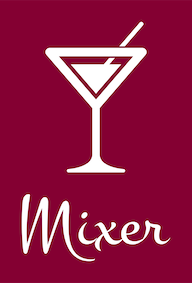
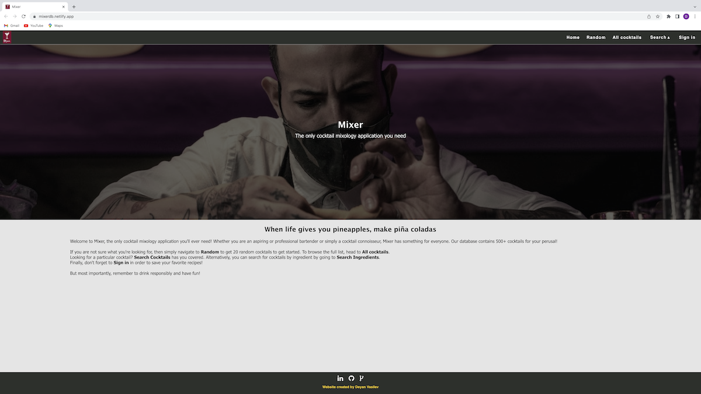
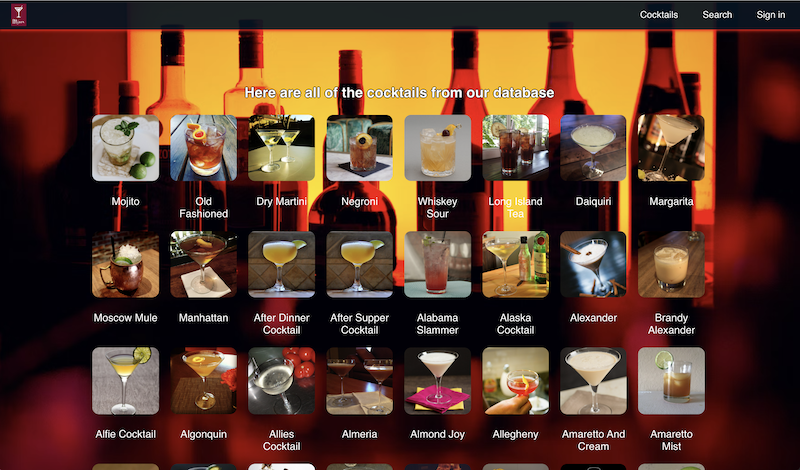
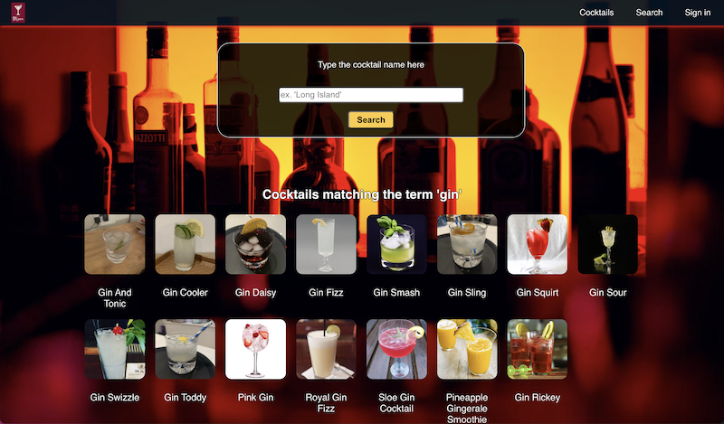
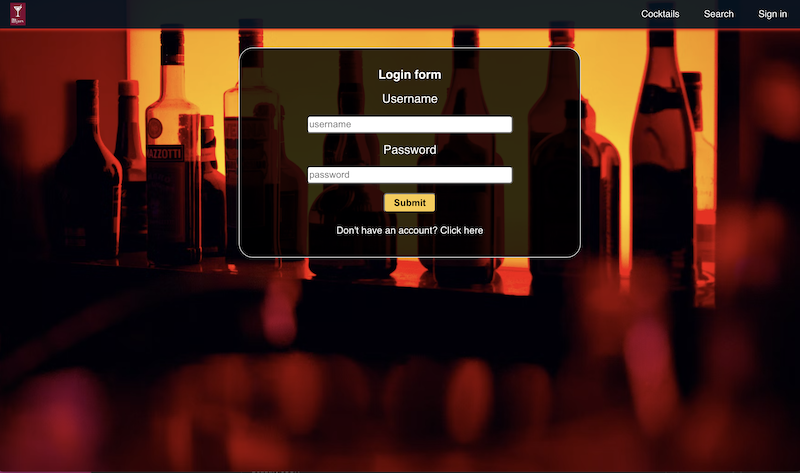
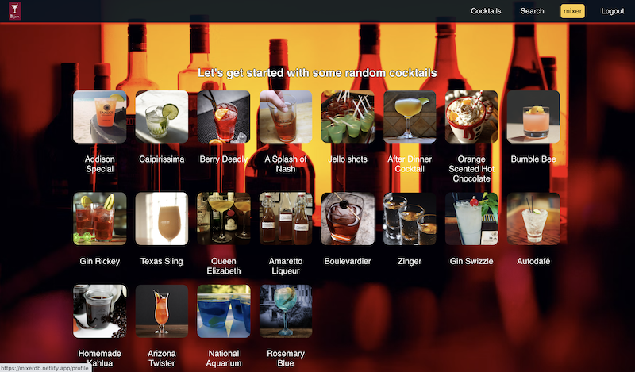
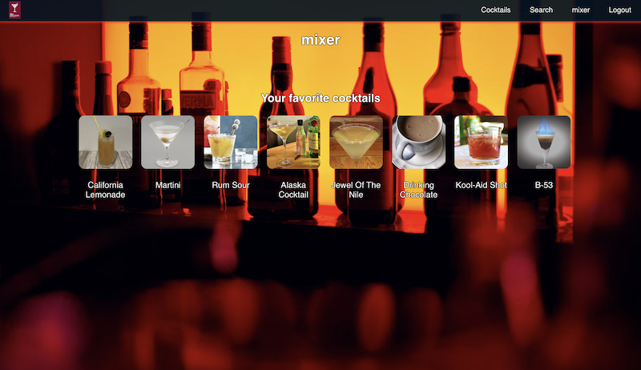
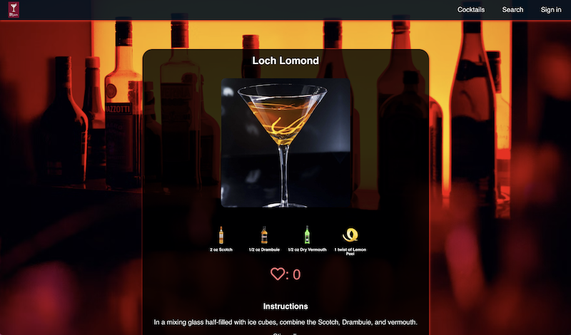
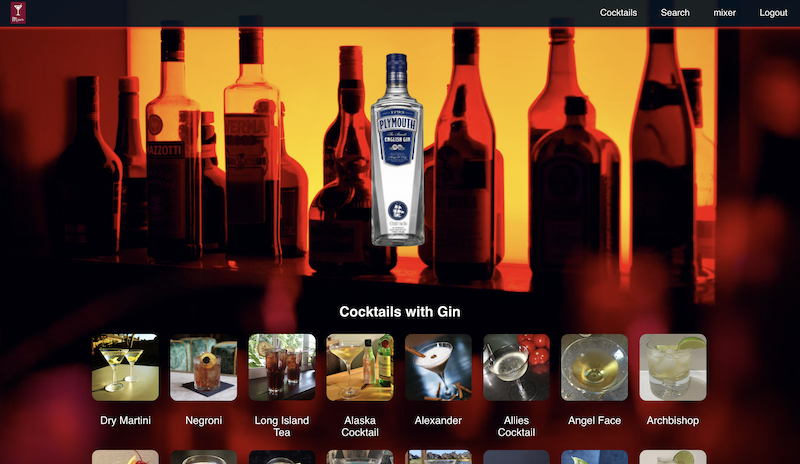

# Mixer

## Overview

Welcome to the Mixer Front End repository!

You can check out the deployed version here --> https://mixerdb.netlify.app/

Mixer is a full stack mixology web application where users can browse information about various cocktails and ingredients as well as keep track of their favorite ones.

The cocktail and ingredient information comes from MixerDB, an API which I built for the purposes of this project.

You can check it out here --> https://github.com/lemonstener/mixerdb

## How to use

This application was built using React.js. In order to run it localy, you must:
1. Clone this repository
2. **npm install** in the terminal to install the modules
3. **npm start** in the terminal to start the server

## The routes

### Homepage - /

Click the logo at top left to be redirected to the homepage. The homepage fetches and displays 20 random cocktails everytime it's visited. Clicking on a cocktail will take you to that cocktails page.

### Cocktails - /cocktails

Fetches and displays all cocktails from the database.

### Search - /cocktails/search & /ingredients/search

Brings up the search engine. Case insenstive, will match anything containg the search term. Works identically for both cocktails and ingredients.

### Sign in - /login & /register

Brings up the login form. Clink the link on the bottom of the form to switch to the register form instead. Once logged in your JWT token is stored in local storage and the app will automatically log you in on future visits. Simply log out before you exit the page if you do not wish to be remembered.

### Profile - /profile

Displays your username and favorite cocktails (if you have any). Must be logged in to access this page.

### Viewing a cocktail - /cocktails/details/:id

Browse a particular cocktail. Displays an image, ingredients, number of likes and instructions. Click the heart icon to add or remove this cocktails from your favorites (must be logged in). Clicking on an ingredient will take you to said ingredients page.

### Viewing an ingredient - /ingredients/details/:id

Browse an ingredient. Displays an image, name and a list of cocktails it is used in. 

That's it! Remember to drink responsibly and not go anywhere near this application unless you're at least 21 years of age.

